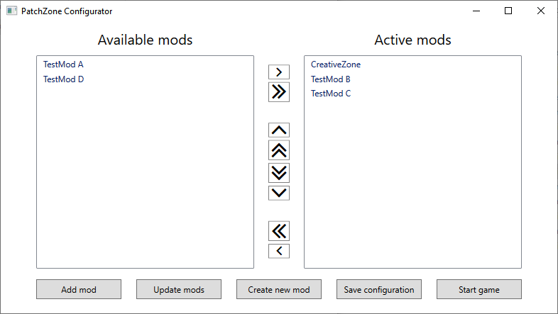

# PatchZone - Modding platform for EndZone a World apart
PatchZone is a modding platform for EndZone a World apart survival city builder game ([Endzone-Game.com](https://endzone-game.com/)). 
 
*Free modders from pain of bootloading their mods into the game and give players simple GUI to install mods!*
 

# Installation
1) Navigate to [Releases page](https://github.com/InflexCZE/PatchZone/releases) and download latest PatchZone archive.
2) Extract PatchZone archive to the root of your game installation.   If you use Steam, by default the game will be located at:   `C:\Program Files (x86)\Steam\Steam\steamapps\common\Endzone - A World Apart\`
3) Navigate to `PatchZone` directory you've just extracted and start `PatchZone.GUI.exe` to open PatchZone graphical interface.
4) To install mod to the game click on "Add mod" button and enter repository URL of mod you'd like to install.
5) Close PatchZone Configurator and start the game as usual.

# How to create PatchZone mod
1) Install PatchZone as described above.
2) Navigate to `PatchZone` directory in game installation and start `PatchZone.GUI.exe` to open PatchZone graphical interface.
3) Click on "Create new mod".
4) Enter name of your new mod and confirm.
5) PatchZone will automatically create new mod from template, activates it so it automatically loads into the game next time you start it and opens Visual Studio (or Visual Studio Code) so you can jump right into modding.  
Read [Quick Introduction to EndZone modding](https://github.com/InflexCZE/PatchZone/wiki/Quick-Introduction-to-EndZone-modding) for more information.

# How to disable PatchZone
In order to return the game back to vanilla state:
1) Navigate to `PatchZone` directory in game installation and start `PatchZone.GUI.exe` to open PatchZone graphical interface.
2) Move all mods from "Active mods" to "Available mods" column
3) Close PatchZone Configurator.

Your game is now vanilla again, no mods will be loaded into the game upon next start.
 
To uninstall PatchZone completely:
1) Delete `PatchZone` directory in game installation root.
2) Delete `doorstop_config.ini` and `winhttp.dll` in game installation root.
3) Optionally: use "Verify integrity of game files" feature in Steam (or equivalent of your installer).

# Contribution Welcomed
If you feel like there is something missing in the PatchZone, find bugs or room for improvements, feel free to open an issue or commit pull request directly. PatchZone is community-made project, by community for community. If you land a hand everyone will benefit.

# Disclamer
PatchZone can make the game unstable and/or crash.
Under no circumstances shall the author(s) be held responsible or liable in any way for any claims, damages, losses, expenses, costs or liabilities whatsoever caused directly or indirectly by PatchZone and/or PatchZone mods and/or derived software.